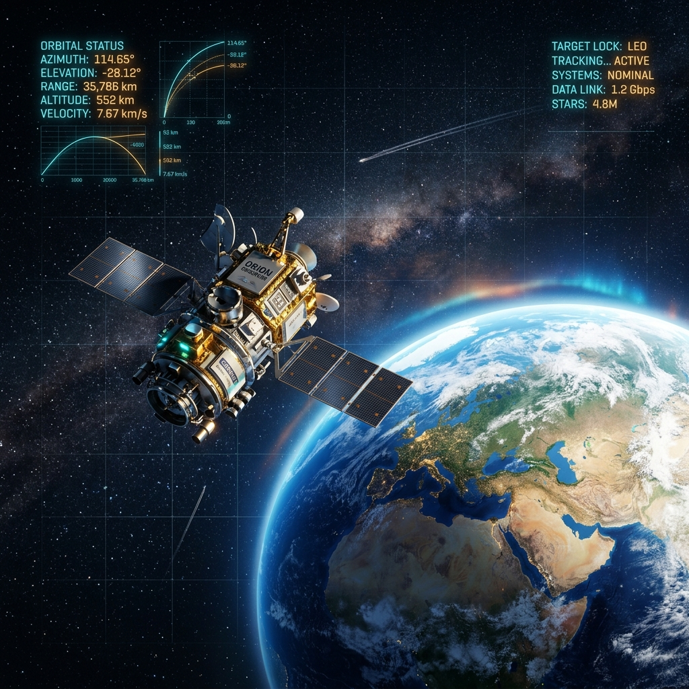

<p align="center">
  
</p>

<h1 align="center">🛰️ Satellite Tracker</h1>

<p align="center">
  
  
  
  
</p>

<p align="center">
  <strong>An advanced, high-performance 3D visualization and telemetry system for real-time satellite tracking.</strong>
</p>

---

## 🚀 Overview

**Satellite Tracker** is a cross-platform application engineered to bridge the gap between complex orbital mechanics and accessible ground-station observation. Built natively with Flutter, the system processes real-time telemetry data to calculate high-precision look-angles (Azimuth, Elevation, and Range) relative to localized observer coordinates. 

Rather than relying on resource-heavy third-party 3D engines, this project utilizes a bespoke mathematical rendering pipeline. By leveraging heavily optimized `CustomPainter` classes and vector mathematics, it delivers a lightweight, low-latency 3D visualization of Earth and satellite trajectories that maintains a strict 60 FPS even on mid-range mobile hardware. It is an ideal tool for aerospace engineers, academic researchers, and IoT hardware integrators requiring reliable terrestrial observation data.

> [!NOTE]  
> **Performance Architecture:** The rendering engine strictly separates state management from UI repaints, ensuring that continuous trigonometric calculations do not block the main thread.
---

## ✨ Features

- **🌍 Realistic Earth Rendering**: High fidelity visualization featuring procedural oceans, continents, and a dynamic atmospheric glow.
- **🌃 Night-Side City Lights**: Real-time terminator line simulation with glowing urban centers on the dark side of the planet.
- **🛰️ 3D Satellite Modeling**: Procedurally generated 3D satellite models with nadir pointing orientation logic.
- **🎥 Dynamic Camera Focus**: Toggleable tracking mode that locks onto the satellite for a cinematic "drone-eye" view of the Earth's surface.
- **📊 Real-Time Telemetry**: Instant calculation of Azimuth, Elevation, and Range Km based on observer coordinates.

---

## 🛠️ Built With

<p align="center">

| Technology           | Implementation                          |
| :------------------- | :-------------------------------------- |
| **Frontend**         | Flutter (Dart)                          |
| **State Management** | BLoC / Cubit                            |
| **Math Engine**      | Vector Math & Custom Spherical Geometry |
| **UI Components**    | Glassmorphism & Custom Look-and-Feel    |

---

## 🏗️ Architecture

The project follows a **Feature-First Clean Architecture** approach to ensure maximum scalability and testability.

```text
lib/
├── core/
│   ├── math/            # Look-angle & Coordinate conversion logic
│   ├── models/          # Shared ECEF and Latitude/Longitude models
│   └── utils/           # Theme tokens and global constants
└── features/
    ├── calculator/      # Telemetry logic and Input panels
    │   ├── logic/       # Calculator Cubit & States
    │   └── view/        # UI widgets for data entry
    └── visualization_3d/ # Core 3D engine and Rendering
        ├── logic/       # Camera and Render states
        └── view/        # Custom Painters for Earth & Satellite
```

---

## 💻 Installation & Setup

1. **Clone the repository**

   ```bash
   git clone https://github.com/Mohamed-ElTahan/satellite.git
   cd satellite
   ```

2. **Fetch dependencies**

   ```bash
   flutter pub get
   ```

3. **Run the application**
   ```bash
   flutter run
   ```

---

<p align="center">
  Designed with ❤️ for Advanced Satellite Tracking
</p>
